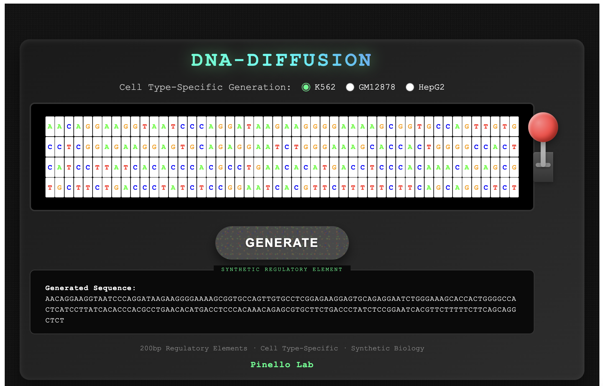

# DNA-Diffusion Gradio App

An interactive web application for generating cell type-specific DNA regulatory sequences using the DNA-Diffusion model from [Pinello Lab](https://pinellolab.org).



## Features

- 🎰 **Interactive Slot Machine Interface**: Visualize DNA sequence generation in real-time with 200 spinning slots
- 🧬 **Cell Type-Specific Generation**: Generate sequences for K562, GM12878, and HepG2 cell lines
- ⚡ **Real-time Feedback**: Continuous animation while the model generates sequences
- 🎨 **Beautiful UI**: Retro-futuristic design with neon effects and smooth animations
- 🤖 **Powered by DNA-Diffusion**: State-of-the-art diffusion model for DNA sequence generation

## Quick Start

### Prerequisites

- Python 3.8+
- CUDA-capable GPU (optional, but recommended for faster generation)
- Git
- uv package manager (for DNA-Diffusion installation)

### Installation

1. **Clone this repository:**
```bash
git clone https://github.com/pinellolab/gradio-dna-diffusion.git
cd gradio-dna-diffusion
```

2. **Install uv package manager:**
```bash
curl -LsSf https://astral.sh/uv/install.sh | sh
```

3. **Clone and install DNA-Diffusion:**
```bash
git clone https://github.com/pinellolab/DNA-Diffusion.git
cd DNA-Diffusion
uv sync
cd ..
```

4. **Install Gradio app dependencies:**
```bash
pip install -r requirements.txt
```

### Running Locally

1. **Basic usage:**
```bash
DNA-Diffusion/.venv/bin/python app.py
```

2. **With options:**
```bash
# Run on a specific port
DNA-Diffusion/.venv/bin/python app.py --port 8080

# Create a public share link
DNA-Diffusion/.venv/bin/python app.py --share

# Run on all network interfaces
DNA-Diffusion/.venv/bin/python app.py --host 0.0.0.0
```

3. **Open your browser** to `http://localhost:7860`

## How to Use

1. **Select a cell type** using the radio buttons (K562, GM12878, or HepG2)
2. **Click GENERATE** or pull the lever to start sequence generation
3. Watch the slots spin while the model generates a 200bp regulatory sequence
4. The generated sequence will be displayed below once complete

## Project Structure

```
gradio-dna-diffusion/
├── app.py                    # Main Gradio application
├── dna_diffusion_model.py    # Model wrapper for DNA-Diffusion
├── dna-slot-machine.html     # Interactive HTML interface
├── requirements.txt          # Python dependencies
├── README.md                 # This file
└── DNA-Diffusion/           # DNA-Diffusion repository (gitignored)
```

## Deployment to Hugging Face Spaces

### Option 1: Direct Deployment

1. **Create a new Space** on [Hugging Face Spaces](https://huggingface.co/spaces)
2. **Select Gradio** as the SDK
3. **Clone your Space locally:**
```bash
git clone https://huggingface.co/spaces/YOUR_USERNAME/YOUR_SPACE_NAME
cd YOUR_SPACE_NAME
```

4. **Copy the required files:**
```bash
cp path/to/gradio-dna-diffusion/app.py .
cp path/to/gradio-dna-diffusion/dna_diffusion_model.py .
cp path/to/gradio-dna-diffusion/dna-slot-machine.html .
cp path/to/gradio-dna-diffusion/requirements.txt .
```

5. **Create app metadata** (`README.md`):
```markdown
---
title: DNA Diffusion Slot Machine
emoji: 🧬
colorFrom: green
colorTo: blue
sdk: gradio
sdk_version: 4.44.1
app_file: app.py
pinned: false
---
```

6. **Push to Hugging Face:**
```bash
git add .
git commit -m "Initial commit"
git push
```

### Option 2: Using GitHub Integration

1. Push this repository to GitHub
2. Create a new Space on Hugging Face
3. Link it to your GitHub repository
4. The Space will automatically build and deploy

### GPU Requirements

For optimal performance, enable GPU in your Space:
1. Go to Settings → Hardware
2. Select T4 GPU or better
3. The model will automatically use GPU if available

## Development

### Running without DNA-Diffusion Model

The app can run in mock mode for UI development:
```bash
python app.py
```

This will use random sequence generation instead of the actual model.

### Customizing the Interface

- Edit `dna-slot-machine.html` to modify the visual interface
- The interface communicates with Gradio backend via `postMessage` API
- Cell types and generation parameters can be extended in `app.py`

## Technical Details

- **Model**: DNA-Diffusion from Pinello Lab (HuggingFace: ssenan/DNA-Diffusion)
- **Sequence Length**: 200bp regulatory elements
- **Cell Types**: K562, GM12878, HepG2 (hESCT0 available in model but not in UI)
- **Generation Time**: 2-5 seconds on GPU, 20-30 seconds on CPU
- **Framework**: Gradio 4.44.1 with custom HTML/JS interface

## Troubleshooting

### Model fails to load
- Ensure DNA-Diffusion is properly installed with `uv sync`
- Check that you're using the DNA-Diffusion virtual environment
- Verify CUDA is available if using GPU: `python -c "import torch; print(torch.cuda.is_available())"`

### Interface doesn't display
- Check that `dna-slot-machine.html` exists in the same directory as `app.py`
- Clear browser cache and reload
- Check browser console for JavaScript errors

### Generation is slow
- Use a CUDA-capable GPU for 10x faster generation
- The first generation includes model warm-up time
- CPU generation typically takes 20-30 seconds

## Citation

If you use this application in your research, please cite:

```bibtex
@article{dnadiffusion2024,
  title={DNA-Diffusion: Leveraging Generative Models for Controlling Chromatin Accessibility and Gene Expression via Synthetic Regulatory Elements},
  author={DaSilva, Lucas Ferreira and Senan, Simon and Patel, Zain Munir and Reddy, Aniketh Janardhan and Gabbita, Sameer and Nussbaum, Zach and Córdova, César Miguel Valdez and Wenteler, Aaron and Weber, Noah and Tunjic, Tin M. and Khan, Talha Ahmad and Li, Zelun and Smith, Cameron and Bejan, Matei and Louis, Lithin Karmel and Cornejo, Paola and Connell, Will and Wong, Emily S. and Meuleman, Wouter and Pinello, Luca},
  journal={bioRxiv},
  year={2024},
  doi={10.1101/2024.02.01.578352},
  url={https://www.biorxiv.org/content/10.1101/2024.02.01.578352v1}
}
```

## License

DNA-Diffusion Gradio Interface is made available for free to academic and non-profit researchers under the Apache License, Version 2.0.

If you plan to use this code or the synthetic sequences generated by the model for profit, please contact lpinello@mgh.harvard.edu for more information.

See LICENSE file for full details.

## Acknowledgments

- [Pinello Lab](https://pinellolab.org) for the DNA-Diffusion model
- [Gradio](https://gradio.app) for the web framework
- DNA-Diffusion team for the pretrained models